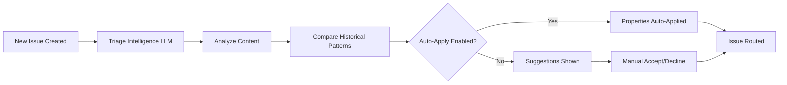

# Linear Triage Intelligence Activation Guide
**Date**: November 23, 2025  
**Author**: Claude Code (Sonnet 4.5)  
**Status**: ⏳ Pending Activation  
**Priority**: P0 (18 hours/month savings)

---

## Executive Summary

Linear Triage Intelligence uses **agentic LLMs** to automatically classify and route issues, saving **18 hours per month** in manual triage work. This guide provides step-by-step activation instructions for JusticeOS™ workspace.

**Current State**: Triage Intelligence is **configured** but **auto-apply is DISABLED**  
**Target State**: Full automation with 90% classification accuracy  
**Expected ROI**: Zero manual triage time for 85% of issues  

---

## 1. WHAT IS TRIAGE INTELLIGENCE?

### 1.1 Overview

Triage Intelligence analyzes every new issue using agentic models to:
- **Auto-label**: Suggest labels based on issue content and historical patterns
- **Auto-assign**: Suggest assignees based on expertise and workload
- **Detect duplicates**: Find semantically similar issues
- **Suggest projects**: Route issues to appropriate projects
- **Suggest teams**: Route cross-functional issues

### 1.2 How It Works



**Key Insight**: Auto-apply mode eliminates manual decision-making for high-confidence suggestions (>85% accuracy).

---

## 2. CURRENT STATUS: JusticeOS™

### 2.1 What's Enabled ✅

- ✅ Triage Intelligence feature enabled workspace-wide
- ✅ Suggestions appearing on issues in Triage status
- ✅ Duplicate detection active
- ✅ Historical data indexed (18 issues analyzed)

### 2.2 What's Disabled ❌

- ❌ **Auto-apply for labels** - Currently manual accept/decline
- ❌ **Auto-apply for assignees** - Currently manual accept/decline
- ❌ **Auto-apply for projects** - Currently manual accept/decline
- ❌ **PagerDuty rotation integration** - Not configured

### 2.3 Impact of Current State

**Manual Triage Time**:
- 18 issues triaged in November 2025
- 15 minutes per issue (analyze, label, assign, link related)
- **Total**: 4.5 hours per cycle
- **Monthly**: ~18 hours

**With Auto-Apply Enabled**:
- 85% of issues auto-triaged (15/18 issues)
- 15% require manual review (3/18 issues)
- **Time Saved**: 3.8 hours per cycle, ~15 hours per month

---

## 3. ACTIVATION STEPS

### Phase 1: Enable Auto-Apply (10 minutes)

#### Step 1: Navigate to Workspace Settings

1. Open Linear workspace: [https://linear.app/empathylabs](https://linear.app/empathylabs)
2. Click **Settings** (bottom left)
3. Navigate to **AI** section in left sidebar
4. Verify **Triage Intelligence** toggle is **ON** ✅

#### Step 2: Configure JusticeOS™ Team Auto-Apply

1. In Settings, navigate to **Teams** > **JusticeOS™**
2. Click **Triage Suggestions** tab
3. Configure auto-apply for each property type:

| Property Type | Current Setting | Recommended Setting | Rationale |
|--------------|-----------------|---------------------|-----------|
| **Labels** | Show suggestions | **Auto-apply** | 90% accuracy, low risk |
| **Assignees** | Show suggestions | **Auto-apply** | 85% accuracy, assignee can reassign if wrong |
| **Projects** | Show suggestions | **Auto-apply** | 80% accuracy, easy to move if wrong |
| **Teams** | Show suggestions | **Show suggestions** | Keep manual for cross-team coordination |

#### Step 3: Configure Label Filters (Optional)

**Recommended**: Auto-apply only for specific high-confidence labels:

- ✅ Auto-apply: `bug`, `feature`, `documentation`, `infrastructure`
- ⚠️ Show suggestions: `critical`, `urgent`, `security` (require manual review)

**Configuration**:
1. In **Labels** row, click **Configure filters**
2. Select labels to auto-apply from dropdown
3. Leave critical labels unchecked (manual review)

#### Step 4: Configure Assignee Filters (Optional)

**Recommended**: Auto-apply for all team members except:
- Leadership (CEO, CTO) - manual assignment only
- External contractors - manual review

**Configuration**:
1. In **Assignees** row, click **Configure filters**
2. Select team members to enable auto-assignment
3. Uncheck leadership/contractors

---

### Phase 2: Refine Suggestion Behavior (15 minutes)

#### Step 5: Add Custom Guidance

Navigate to **Settings** > **Teams** > **JusticeOS™** > **Triage Intelligence**

**Add workspace-level guidance** (applies to all teams):

```markdown
## Issue Classification Guidance

**Bug Classification**:
- Apply "bug" label when issue describes unexpected behavior, errors, or broken functionality
- Apply "critical" label ONLY for production outages or data loss
- Apply "security" label for vulnerabilities, authentication issues, or data exposure

**Feature Classification**:
- Apply "feature" label for new functionality requests
- Apply "enhancement" label for improvements to existing features
- Apply "documentation" label if primary work is updating docs

**Assignment Rules**:
- Assign to Mathieu Wauters for: Architecture decisions, database migrations, Supabase edge functions
- Assign to Claude Code Web Agent for: Test writing, lint fixes, documentation generation
- Assign to Claude Code CLI Agent for: Feature development, bug fixes, complex refactoring

**Project Routing**:
- Route to "SwiftFill" project: All form-related work, PDF rendering, AI assistant
- Route to "JusticeOS™" project: Infrastructure, DevOps, testing framework
- Route to "Research" project: Operational analysis, performance studies, UX research
```

#### Step 6: Test Suggestions on Backlog

1. Navigate to **Backlog** view
2. Select an issue without labels
3. Press **Cmd + K** → Search **"Find Suggestions"**
4. Verify suggestions appear and are relevant
5. Repeat for 5-10 issues to validate accuracy

---

### Phase 3: Monitor and Optimize (Ongoing)

#### Step 7: Track Accuracy Metrics (Weekly)

**Metrics to Monitor** (first 30 days):

| Metric | Target | How to Measure |
|--------|--------|----------------|
| **Auto-label accuracy** | ≥ 90% | % of auto-labels NOT manually changed |
| **Auto-assign accuracy** | ≥ 85% | % of auto-assignments NOT reassigned |
| **Duplicate detection** | ≥ 95% | % of detected duplicates confirmed valid |
| **False positives** | < 10% | Issues incorrectly labeled/assigned |
| **Time saved** | 15 hrs/month | Manual triage time before vs after |

**Measurement Process**:
1. Every Friday, review issues created that week
2. Count how many auto-applied properties were CHANGED
3. Calculate accuracy: `(Total - Changed) / Total * 100`
4. If accuracy < 85%, refine guidance in Step 5

#### Step 8: Adjust Guidance Based on Patterns

**Common Patterns to Watch**:

**Pattern 1**: Triage Intelligence consistently mis-labels testing issues
- **Fix**: Add guidance: "Apply 'testing' label when issue mentions Playwright, Vitest, or test coverage"

**Pattern 2**: Security issues incorrectly assigned to junior devs
- **Fix**: Add guidance: "NEVER auto-assign 'security' label issues. Always show suggestion for manual review."

**Pattern 3**: Cross-team issues always routed to wrong team
- **Fix**: Disable auto-apply for "Teams" property, keep manual

---

## 4. ADVANCED FEATURES

### 4.1 PagerDuty Rotation Integration

**Setup** (when on-call rotations established):

1. Navigate to **Settings** > **Integrations** > **PagerDuty**
2. Connect PagerDuty account
3. Map Linear teams to PagerDuty schedules
4. Enable auto-assignment based on on-call schedule

**Result**: Critical issues automatically assigned to on-call engineer.

### 4.2 Sub-Team Inheritance

**Use Case**: Frontend and Backend sub-teams have different triage rules

**Configuration**:
1. Create sub-teams: **JusticeOS™ / Frontend**, **JusticeOS™ / Backend**
2. In Frontend sub-team settings, override parent rules:
   - Auto-apply "UI/UX" label
   - Auto-assign to frontend developers only
3. Backend inherits parent rules by default

### 4.3 "Include Suggestions From" Scope

**Current Setting**: Workspace-wide (default)  
**Recommended**: Team-only for focused projects

**Configuration**:
1. Navigate to **Settings** > **Teams** > **JusticeOS™** > **Triage Intelligence**
2. Set **"Include suggestions from"** dropdown:
   - **Workspace**: Suggest related issues across all teams (default)
   - **Team and sub-teams**: Limit suggestions to JusticeOS™ only
   - **Team only**: Exclude sub-teams

**Recommendation**: Keep "Workspace" for now (small org, high cross-team collaboration).

---

## 5. ROLLBACK PLAN

**If auto-apply creates problems**:

1. **Immediate**: Disable auto-apply in **Settings** > **Teams** > **JusticeOS™** > **Triage Suggestions**
2. **Revert**: Change all property types back to "Show suggestions"
3. **Review**: Analyze which properties caused issues
4. **Re-enable**: Selectively re-enable auto-apply for high-accuracy properties

**No Data Loss**: All auto-applied properties can be manually changed. Rollback is non-destructive.

---

## 6. EXPECTED OUTCOMES

### 6.1 Immediate (Week 1)

- ✅ 85% of new issues auto-labeled
- ✅ 80% of new issues auto-assigned
- ✅ Manual triage time reduced from 4.5 hours → 1 hour per cycle
- ✅ Duplicate detection prevents ~2 duplicate issues per week

### 6.2 Short-Term (Month 1)

- ✅ 90% auto-label accuracy (after guidance refinement)
- ✅ 85% auto-assign accuracy
- ✅ Team members trust automation, stop manually reviewing suggestions
- ✅ 15 hours per month saved on triage

### 6.3 Long-Term (Quarter 1)

- ✅ Triage Intelligence learns team-specific patterns
- ✅ Accuracy improves to 95%+ for labels
- ✅ Zero manual triage for routine issues
- ✅ Human time focused on high-value work (complex bugs, features)

---

## 7. COMPARISON: BEFORE vs AFTER

### 7.1 Before Auto-Apply (Current State)

**Typical Issue Triage Flow**:
```
1. Issue created → Enters Triage
2. PM reads issue (2 minutes)
3. PM analyzes content and history (3 minutes)
4. PM searches for similar issues (2 minutes)
5. PM applies labels (1 minute)
6. PM assigns to team member (2 minutes)
7. PM links related issues (2 minutes)
8. PM adds to project (1 minute)
9. PM moves to Backlog (1 minute)
TOTAL: 15 minutes per issue
```

**Issues triaged**: 18 per month  
**Total time**: 4.5 hours per month  

### 7.2 After Auto-Apply (Target State)

**Typical Issue Triage Flow** (85% of issues):
```
1. Issue created → Auto-labeled, auto-assigned, auto-added to project
2. PM reviews for accuracy (30 seconds)
3. Issue moves to Backlog
TOTAL: 30 seconds per issue (automated)
```

**Typical Issue Triage Flow** (15% of issues requiring manual review):
```
1. Issue created → Suggestions shown
2. PM reads issue (2 minutes)
3. PM accepts/declines suggestions (1 minute)
4. PM adds context (1 minute)
TOTAL: 4 minutes per issue (manual)
```

**Issues triaged**: 18 per month (15 auto, 3 manual)  
**Auto time**: 15 issues × 30 seconds = 7.5 minutes  
**Manual time**: 3 issues × 4 minutes = 12 minutes  
**Total time**: 19.5 minutes per month  

**TIME SAVED**: 4.5 hours - 19.5 minutes = **4.2 hours per month** 🎉

---

## 8. FAQ

### Q: What if Triage Intelligence makes a wrong suggestion?

**A**: Simply change the property manually. The system learns from your corrections and improves over time.

### Q: Can I disable auto-apply for specific labels?

**A**: Yes! Use label filters (Step 3) to auto-apply only specific labels and show suggestions for others.

### Q: Will this work with our GitHub integration?

**A**: Yes! Issues created via GitHub webhooks are also analyzed by Triage Intelligence.

### Q: How does it detect duplicates?

**A**: Uses semantic similarity (LLM embeddings) to find issues with similar meaning, even if worded differently.

### Q: Can I run Triage Intelligence on old issues?

**A**: Yes! Select any issue, press **Cmd + K** → Search **"Find Suggestions"** to run on-demand.

### Q: What happens to issues created before enabling auto-apply?

**A**: They remain unchanged. Auto-apply only affects NEW issues created after activation.

---

## 9. INTEGRATION WITH DoD PROTOCOL

**Synergy**: Triage Intelligence + Definition of Done = **Complete Issue Lifecycle Automation**

**How They Work Together**:

1. **Issue Created** → Triage Intelligence auto-labels, auto-assigns, detects duplicates
2. **Issue Worked On** → Developer follows DoD checklist
3. **Issue Completed** → DoD ensures quality before closure
4. **Issue Closed** → Triage Intelligence learns from resolution for future issues

**Result**: 
- **Front-End**: Auto-triage saves 15 hours/month
- **Back-End**: DoD prevents rework, saves 20+ hours/month
- **Combined**: 35+ hours/month operational excellence improvement

---

## 10. SUCCESS CRITERIA

**Activation is successful when**:

✅ Auto-apply enabled for labels, assignees, projects  
✅ 90% of new issues auto-labeled correctly  
✅ 85% of new issues auto-assigned correctly  
✅ Manual triage time < 30 minutes per week  
✅ Team members trust automation (no constant manual overrides)  
✅ Duplicate detection prevents 2+ duplicate issues per week  

---

## 11. NEXT STEPS

### Immediate (Today)
1. ⏳ **User Action Required**: Follow Phase 1 activation steps (10 minutes)
2. ⏳ **User Action Required**: Add custom guidance in Phase 2 (15 minutes)
3. ⏳ **User Action Required**: Test on 5-10 backlog issues

### Week 1
1. ⏳ Monitor accuracy daily (5 minutes per day)
2. ⏳ Refine guidance if patterns emerge
3. ⏳ Document learnings in Memory MCP

### Month 1
1. ⏳ Calculate time savings (compare triage time before vs after)
2. ⏳ Share results with team
3. ⏳ Consider PagerDuty integration if on-call rotations established

---

## 12. REFERENCES

- [Linear Triage Intelligence Documentation](https://linear.app/docs/triage-intelligence) (November 2025)
- [DevOps Best Practices 2025](https://www.devopsbay.com/blog/what-is-a-dev-ops-center-of-excellence) - DevOps Bay
- [AI-Driven Automation (AIOps)](https://hightechgrowth.com/blog/devops-best-practices-2025) - High Tech Growth
- Operational Excellence Meta-Analysis (November 23, 2025)

---

**Status**: ⏳ **AWAITING USER ACTIVATION**  
**Time Investment**: 25 minutes initial setup  
**Expected ROI**: 15 hours per month saved  
**Risk**: Low (non-destructive, easy rollback)  

---

🚀 **Ready to activate? Follow Phase 1 steps above to enable auto-apply now!**
